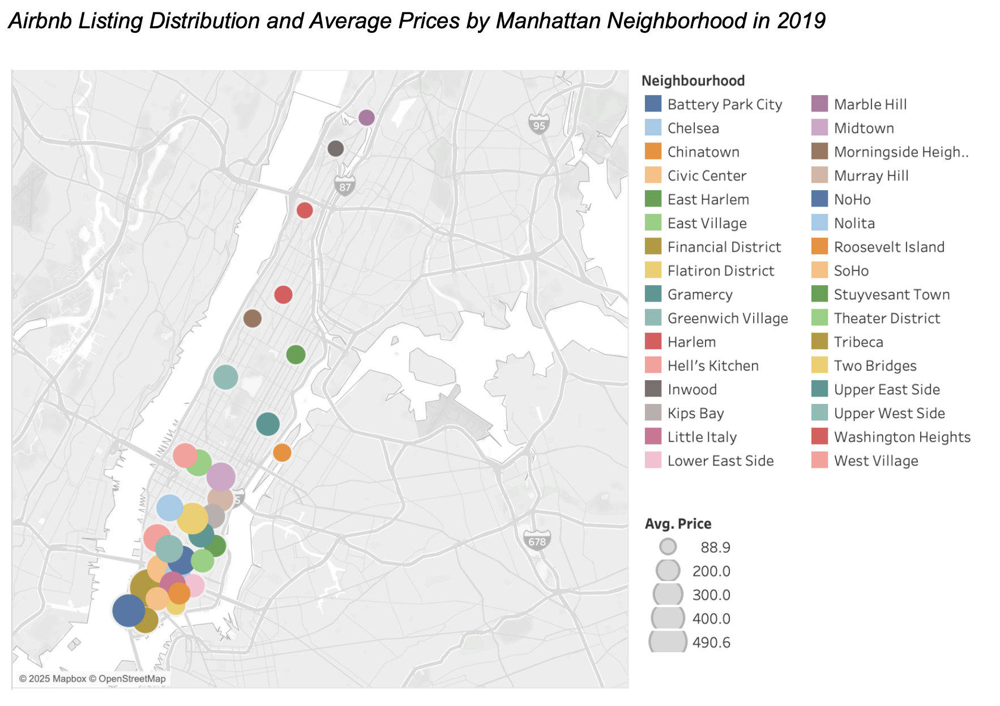
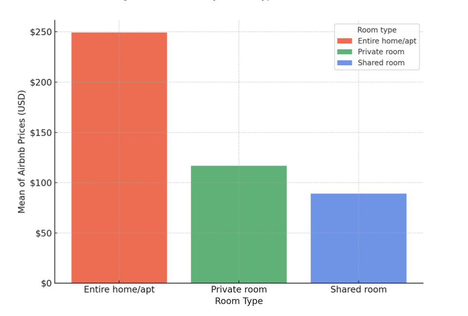
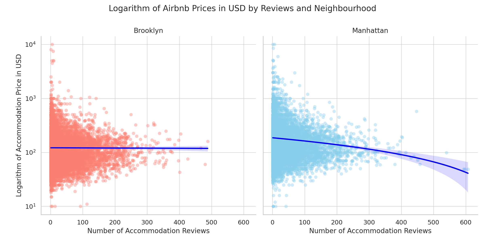
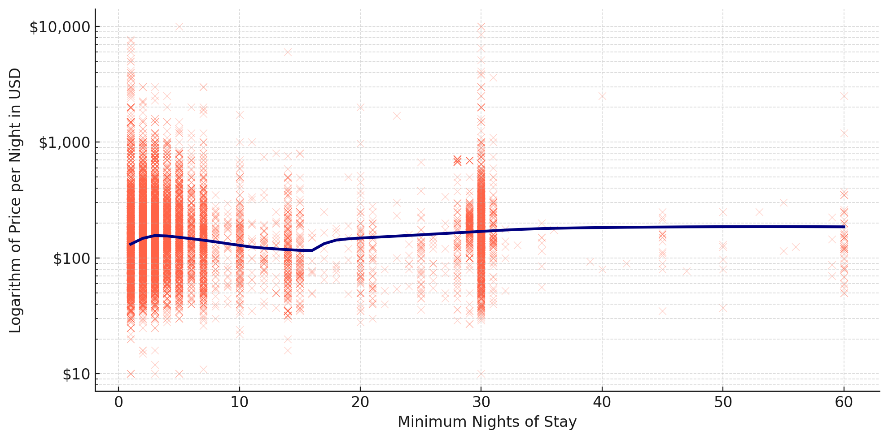

# What Drives Airbnb Prices in New York City?

> A data-driven exploration of what factors most influence Airbnb pricing across NYC neighborhoods — reframed through a business analytics lens.

---

## Executive Summary

This project analyzes **48,895 Airbnb listings in New York City (2019)** to identify the key factors driving price differences across neighborhoods and room types.  
The findings provide **data-driven insights** that can inform **pricing strategy, investment decisions, and product design** for hosts, investors, and platforms like Airbnb.

---

### Key Insights

1. **Location is the primary driver of price**
   - Manhattan and Brooklyn host over 80% of listings, with **Manhattan commanding the highest prices**.
   - Prices cluster highest in **southern Manhattan**, near major attractions.

   
   > *Southern Manhattan neighborhoods like Tribeca and SoHo capture the premium market segment due to tourist proximity.*

---

2. **Room type determines price tier**
   - **Entire homes/apartments** are priced nearly **2× higher** than shared accommodations.
   - Private rooms occupy a mid-range price band with moderate variability.

   
   > *Guests pay significantly more for privacy and exclusivity — a key opportunity for hosts targeting higher margins.*

---

3. **Number of reviews does not significantly affect price**
   - Listings with many reviews often remain in the mid-price range.
   - Suggests reputation influences **occupancy**, not pricing power.

   
   > *A well-reviewed listing may book more frequently, but not necessarily at a premium rate.*

---

4. **Stay duration patterns reveal dual market segments**
   - Listings with **no minimum stay** have the widest price variance.  
   - **30-night minimums** often correlate with **higher average prices**, likely targeting business travelers.

   
   > *Extended-stay guests represent a distinct high-value market segment.*

---

### Business Implications

- **Optimize Pricing:** Adjust prices by neighborhood and room type to maximize revenue per available listing (RevPAL).  
- **Target Growth Areas:** Focus new host recruitment or investment in **high-demand, premium neighborhoods**.  
- **Expand Long-Stay Offerings:** Tailor packages for business travelers and extended guests.  
- **Leverage Location Intelligence:** Use geographic analytics to identify under- or over-valued areas.

---

## Business Recommendations

Based on the analysis of Airbnb listings across New York City, the following recommendations are proposed for hosts, investors, and Airbnb’s strategy teams.  

---

### 1. Optimize Pricing by Location and Room Type
**Insight:** Manhattan and Brooklyn dominate the market, with entire homes pricing nearly twice as high as shared spaces.  

**Recommendation:**  
- Implement **dynamic pricing models** that adjust rates by neighborhood and property type.  
- Encourage hosts in lower-demand areas (e.g., Queens or Bronx) to differentiate through amenities or flexible stays.  
- For high-demand zones (e.g., SoHo, Tribeca), focus on premium positioning — emphasizing exclusivity, design, and proximity to attractions.  

**Business Impact:**  
→ Higher average revenue per listing (RevPAL) and improved occupancy rates across boroughs.  

---

### 2. Expand Long-Stay and Business Travel Offerings
**Insight:** Listings with minimum 30-night stays have higher average prices, suggesting a viable long-stay market.  

**Recommendation:**  
- Develop **“Business-Ready” listing programs** — Wi-Fi quality, workspace, and discounts for monthly stays.  
- Offer **corporate partnerships** or relocation packages targeting extended-stay travelers.  

**Business Impact:**  
→ Diversifies Airbnb’s customer segments and increases average booking value (ABV).  

---

### 3. Enhance Listing Reputation Through Review Quality
**Insight:** Number of reviews doesn’t directly influence price but likely affects booking frequency.  

**Recommendation:**  
- Incentivize **quality reviews** rather than quantity — prompt recent guests with personalized follow-ups.  
- Add a **review-based ranking** to highlight top-rated properties in search results.  
- Provide **host training or analytics dashboards** to improve guest experience metrics.  

**Business Impact:**  
→ Increased conversion rate and customer trust, leading to sustainable occupancy growth.  

---

### 4. Invest in Location Intelligence
**Insight:** Southern Manhattan clusters the highest-priced listings due to tourist proximity.  

**Recommendation:**  
- Use **geospatial analytics** to forecast pricing and identify undervalued areas.  
- Support local governments or hosts with insights on **tourism density** and **housing impact**.  
- Prioritize expansion or marketing in emerging high-value neighborhoods (e.g., Williamsburg, DUMBO).  

**Business Impact:**  
→ Smarter investment allocation and data-backed city engagement.  

---

### 5. Build a Data-Driven Pricing Dashboard
**Insight:** Exploratory visualizations reveal multiple factors influencing price, but they’re static.  

**Recommendation:**  
- Develop an **interactive Tableau or Power BI dashboard** combining:  
  - Dynamic price filters by neighborhood and room type  
  - KPI tracking (RevPAL, occupancy, ALOS)  
  - Scenario modeling (“what if” pricing simulations)  

**Business Impact:**  
→ Enables continuous monitoring, agile pricing decisions, and actionable insights for hosts or Airbnb’s pricing teams.  

---

## Measurement Plan

| **Objective** | **KPI** | **Target** | **Timeframe** |
|----------------|----------|-------------|---------------|
| Optimize pricing & revenue | Revenue per available listing (RevPAL) | +10% | 6 months |
| Improve occupancy | Occupancy rate | +8% | 6 months |
| Grow long-stay segment | Avg. booking value (ABV) | +15% | 1 year |
| Strengthen trust & engagement | Review satisfaction score | +0.3 pts | 6 months |

---

## Methodology

- **Dataset:** [NYC Airbnb Open Data (2019, Kaggle)](https://www.kaggle.com/datasets/dgomonov/new-york-city-airbnb-open-data)
- **Tools:** Python (Pandas, Matplotlib, Seaborn), Tableau
- **Approach:** Exploratory Data Analysis (EDA)
- **Focus Areas:** Neighborhood, room type, reviews, minimum stay
- **Techniques:**  
  - Data cleaning and transformation  
  - Logarithmic scaling for price normalization  
  - Visualization for trend identification  

---

## Limitations & Future Work

- Dataset reflects 2019 data only (pre-pandemic)
- Seasonality and amenity data not included
- Descriptive (non-predictive) analysis — future work could apply machine learning models for price prediction or clustering

---

## 📂 Repository Structure

